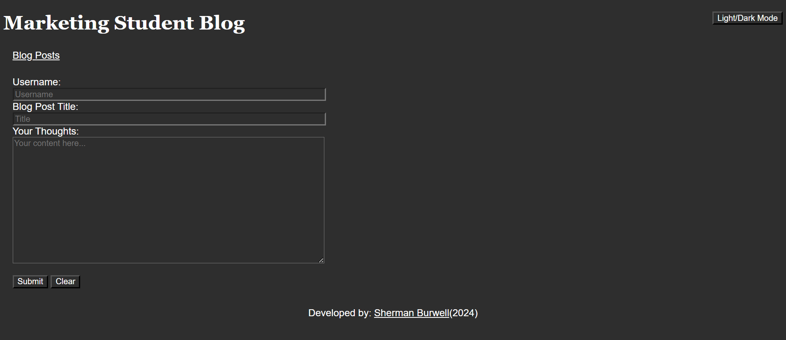

# Student Blog Site

## Description

This is a blog site designed for students in mind. All blog posts are saved to the browser's local storage to be used for later.

## Instructions for Use

Fill out all three necessary text fields and click subit to create a blog post. You will be redirected to the main blog site with all of your posts.

## Link to Deployed Application

https://shermanburwell3.github.io/student-blog-site/

## Screenshot

## Credits

Thank you to Semrush Blog for the window.location.href functionality used in my blog.js.
link: https://www.semrush.com/blog/javascript-redirect/

Thank you to Hub Spot author Anna Fitzgerald for the code for the textbox area and placeholder text.
link: https://blog.hubspot.com/website/html-text-box